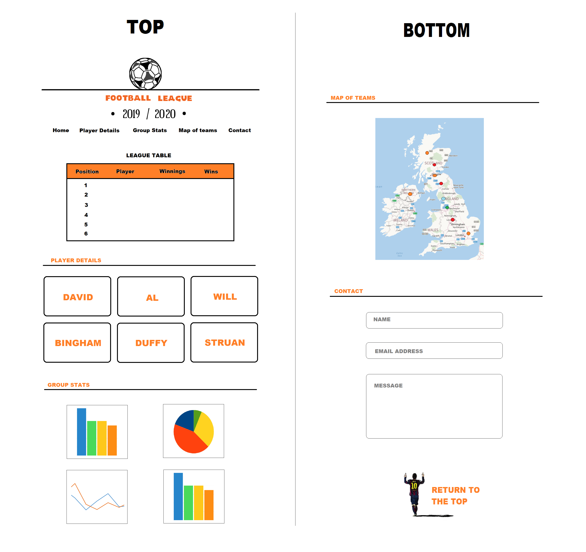
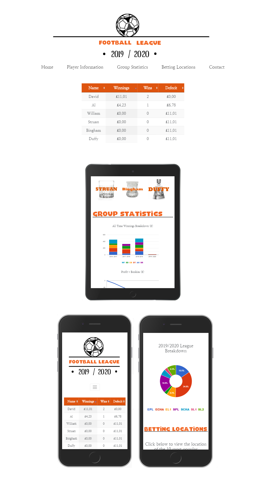

<h1>Football Betting Group 2019/2020</h1>

Six friends take part in an annual contest in which they place a £2 accumulator bet on the weekend’s football matches. 
At the end of the season, the contestant with the highest total winnings is declared champion.
 

The purpose of this site is to present a series of metrics and statistics in an attractive, easy to understand way.

<h2>UX</h2>

The site has a simple, clean layout with a limited colour-scheme of black and grey contrasted with a more vibrant orange. 
The majority of the screen will be filed with white, drawing the user’s attention to the various elements of the site.

The original design of the site is shown below. The final version is broadly the same although you will notice one or two changes that were made during development.

The visitors to the site will be the six participants in the contest. The site’s primary function is to display a "league table" showing the current 
standings of the competitors and so this element has been placed at the top of the page.

The league table is supplemented with other performance metrics, which focus on individual participants as well as the group as a whole.

<h3>USER STORIES</h3>

Below are a number of scenarios, which demonstrate how a visitor to the site might navigate through the various sections.

<b>David</b> wants to see how this weekend’s football results have affected his standings in the table. He scrolls down to the league table, 
which is the first element of the site, and sees that he is now in 5th place.
 

He wants to see how he is performing in terms of wins this year and so clicks on the heading of the ‘wins’ column. The order of this column is re-sorted 
allowing him to see how he ranks in that particular respect.

<b>William</b> wants to view some information about the trends in his betting this season. In the navigation bar, he selects the option ‘Player Information’ 
and is taken down to that section of the site.

He selects his name from the 6 buttons and a modal pops up. He sees in the section 2019 / 2020 Season’ that his average odds for this year are 
26/1 and his new favorite team (the team he selects the most often) is Leeds United. While the modal is open, 
he hovers his mouse over the image on the right hand side and is presented with a pop up that reminds him that he won the title in 2017 and 2019.

<b>Struan</b> notices an error in his total in the league table. In the navigation bar, he selects the option ‘Contact’ and is taken down to the bottom of the site. 
There, he enters his name, email address and a message, which will be sent to the administrator’s Gmail account.

<b>Bingham</b> wants to know the location of the teams the teams he has selected most often. He scrolls down to the map and hits the button. 
As the markers drop down consecutively, he can easily see where his markers are landing. He zooms in on a particular marker and hover his mouse over it. 
A pop-up confirms that he has selected this team on 3 occasions this year.

<b>Duffy</b> wants to see how the group as a whole is performing against the bookmakers this season. In the navigation bar, he selects ‘Group Statistics’ 
and is taken down to that sections of the site. He sees that the second chart displays this information. The Vertical Axis tells him that the group is currently 
£6.71 behind the bookmakers, an improvement on match day 11, when the group were losing by £77.86 in arrears.

<h2>Features</h2>

<h3>Existing Features</h3>

<ol>
<li>(Navbar) The navbar allows the user to navigate to the various sections on the page. It collapses into a ‘burger’ in smaller screen sizes.</li>
<li>(league table) The league table ranks the players by their winnings in its default position. It is interactive, allowing the user to sort the data in the other columns.</li>
<li>(Player Information) Each player has a separate button which, when clicked, displays a modal with data and an image confirming their total trophies won. When hovering over this image, a popup confirms which trophies they have won and in which years.</li>
<li>(Group Information) There are 4 charts showing information about the group’s performances this season and in previous seasons too.</li>
<li>(Map) The map shows the locations of the ten teams selected the most time by each player. It is colour coded and the markers drop down consecutively to let players see their selections more easily.</li>
<li>(contact form) A contact form allows users to reach out to the site’s administrator if, for example, they want features added or if data is incorrect. The form is linked to a Gmail account via EmailJS.</li>
<li>(return to top button) In an image of the footballer Lionel Messi. This image functions as a button and returns players to the top of the page.</li>
</ol>

<h3>Features Left to Implement</h2>

<ol>
<li>I would like the map to have a separate button for each of the contestants. At present, if a location has been selected by more than one player, the markers are very close to each other and so it is necessary to zoom in very close to see the separate markers.</li>
<li>I would like a success message to display when a message is sent from the contact form.</li>
</ol>

<h2>Technologies Used</h2>

<ul>
<li>Data Tables (https://datatables.net) Used to create the site's league table.</li> 
<li>Google Charts (www.developers.google.com/chart) Used to create the site's graphs in the 'Group Statistics' section.</li> 
<li>JQuery (www.jquery.com) The project uses JQuery to simplify DOM manipulation.</li>
<li>Google Fonts (www.fonts.google.com) The typeface used throughout the site uses Google Fonts.</li>
<li>Bootstrap (www.getbootstrap.com) Used to create the navigation bar, buttons and grid layout.</li>
<li>Google Maps (www.developers.google.com/maps) Used for the ‘Betting Locations’ section.</li>
<li>EmailJS (www.emailjs.com) The contact form is linked to a Gmail account using this site.</li>
<li>MS Paint – Used to create the original design, and for various other images on the site</li>
</ul>

<h2>Testing</h2>

The HTML code was tested in The W3C Markup Validation Service (https://validator.w3.org). A number of errors were identified and corrected, 
however there were a number of issues which I found broke the site when I attempted to correct them. I have detailed these below:

<ol>
<li><b>Warning: "The type attribute is unnecessary for JavaScript resources"</b> - I found that removing the type attribute caused the JavaScript to stop working so I left this in.</li>
<li><b>Error: "Bad value 100% for attribute width"</b> - I found no way to replicate my desired outcome using anything other than the % attribute</li>
<li><b>Error: "The width attribute on the table element is obsolete. Use CSS instead"</b> - I found no way to replicate my desired outcome using CSS</li>

</ol>

<h3>Step-by-step testing of the site's functionality</h3>

<h4>Navigation Bar</h4>

<ol>
<li>User clicks on the navigation bar item “Player Information” and is taken down to that section of the website.</li>
<li>User clicks on the navigation bar item “Group Statistics” and is taken down to that section of the website.</li>
<li>User clicks on the navigation bar item “Betting Locations” and is taken down to that section of the website.</li>
<li>User clicks on the navigation bar item “Contact” and is taken down to that section of the website.</li>
<li>In mobile view, the navigation bar shrinks to a burger image. When clicked on, the navigation items are displayed below.</li>
</ol>

<h4>League Table</h4>

<ol>
<li>User clicks on the heading of the “Name” column and the data is sorted alphabetically. Click again and it re-sorts in reverse alphabetical order.</li>
<li>User clicks on the heading of the “Winnings” column and the data is sorted from high to low. Click again and it re-sorts from low to high.</li>
<li>User clicks on the heading of the “Wins” column and the data is sorted from high to low. Click again and it re-sorts from low to high.</li>
<li>User clicks on the heading of the “Deficit” column and the data is sorted from high to low. Click again and it re-sorts from low to high.</li>
</ol>

<h4>Player information buttons</h4>

<ol>
<li>User hovers over a button with the mouse and the image grows larger.</li>
<li>User clicks on the image and a modal pop up appears.</li>
<li>User hovers their mouse over the ‘trophies’ image and a pop up displays dates of wins.</li>
</ol>

<h4>Group information</h4>

<ol>
<li>User hovers their mouse over the charts and specific information is displayed regarding that specific piece of data.</li>
</ol>

<h4>Betting Locations</h4>

<ol>
<li>User clicks on the “Click Here” button and markers drop down onto the map, one after the other.</li>
<li>The user then zooms in on the map and hover the mouse over a specific market. A pop-up shows the player to whom the market applies and how many times they have made this particular selection.</li>
</ol>

<h4>Contact Form</h4>

<ol>
<li>User fills in their name and adds a message but does not enter their email address. A message pops up below the ‘Email’ field stating “Please fill in this field”.</li>
<li>User fills in their email address and adds a message but does not enter their name. A message pops up below the ‘Name’ field stating “Please fill in this field”.</li>
<li>User fills in their name and email address but does not enter a message. A message pops up below the ‘Message’ field stating “Please fill in this field”.</li>
</ol>

<h4>“Return to the Top” button</h4>

<ol>
<li>Player hovers their mouse over the button and it expands slightly in size.</li>
<li>Player clicks on the button and it returned to the top of the page.</li>
</ol>

<h3>Performance on different devices</h3>

There are a few differences in terms of layout between large and small screens and these are detailed below.
 

<ul>
<li>For The site's logo and the section headings, a different image is used depending on the screen width, with the other image hidden.</li> 
<li>The padding on either side of the site's content is larger when viewed in bigger screen sizes.</li>
<li>In smaller screens the navigation bar collapses into a burger.</li>
<li>In smaller screens, the charts are all on top of each other, whereas in larger screens they are 2 side-by-side.</li>
</ul>

<h2>Bugs or problems encountered during testing</h2>

<ul>
<li>The image in the modal protruded from the bottom of the modal on certain mobile devices. This was resolved by making the image fractionally smaller.</li>
<li>There is an issue with the map markers, where they appear at their final location for a fraction of a second before dropping down to that location. I have yet to resolve this bug.</li>
</ul>

<h2>Deployment</h2>

The project has been deployed on GitHub Pages (https://taylord1982.github.io/footytest/#).

For the site to function correctly when published from Github, it was necessary to enter settings > Github Pages and change 
the source to Master Branch.
 

<h2>Credits</h2>

<h3>Media</h3>

The photos used in this site were obtained from https://www.robertdyas.co.uk

I used https://www.font-generator.com/ to create the site's logo.

<h3>Acknowledgements</h3>

I’d like to thank those on Slack who assisted me with a few issues when I was unable to find the solutions on Google or by experimentation. In particular Anna Greaves and my mentor Seun provided valuable assistance and support.
